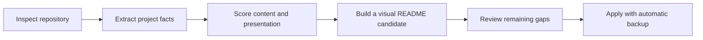

<a name="readmemagic"></a>
<p align="center">
  
</p>

<p align="center">
  <h1 align="center">✨ ReadmeMagic</h1>
  <p align="center">
    <strong>Turn any repository into a beautiful, high-impact GitHub project page</strong><br>
    <em>理解真实项目，一键生成更好看、更会展示内容的 README.md</em>
  </p>
  <p align="center">
    <a href="#-features">Features</a> •
    <a href="#%EF%B8%8F-showcase">Showcase</a> •
    <a href="#-installation">Installation</a> •
    <a href="#-usage">Usage</a> •
    <a href="#-templates">Templates</a> •
    <a href="#-language-support">Language Support</a> •
    <a href="#%EF%B8%8F-banner-auto-generation">Banner</a> •
    <a href="#-examples">Examples</a>
  </p>
</p>

<p align="center">
  
  
  
  
  
</p>

<p align="center">
  <strong>English</strong> | <a href="README_ZH.md">中文</a>
</p>

---

## ✨ Features

<table>
  <tr>
    <td width="50%">
      <h3>🔍 Project-aware Analysis</h3>
      <ul>
        <li>Detects Python, Node.js, Rust, and Go metadata</li>
        <li>Finds real install and usage commands</li>
        <li>Scores content, presentation, onboarding, and trust</li>
      </ul>
    </td>
    <td width="50%">
      <h3>🛡️ Safe Optimization</h3>
      <ul>
        <li>Creates <code>README.optimized.md</code> by default</li>
        <li>Preserves useful existing sections</li>
        <li><code>--apply</code> creates <code>README.md.bak</code></li>
      </ul>
    </td>
  </tr>
  <tr>
    <td width="50%">
      <h3>🤖 Agent-first Workflow</h3>
      <ul>
        <li>Codex-compatible Skill metadata</li>
        <li>Evidence-first README review protocol</li>
        <li>Built-in quality gate and safety rules</li>
      </ul>
    </td>
    <td width="50%">
      <h3>🌐 Templates and Languages</h3>
      <ul>
        <li>English and Chinese optimization</li>
        <li>5 template families with EN / ZH / bilingual variants</li>
        <li>Optional badges, Star History, and generated banners</li>
      </ul>
    </td>
  </tr>
</table>

> ReadmeMagic treats README as the project's primary landing page: a strong first screen, real project visuals, scannable highlights, and the shortest verified path to first success.

---

## 🖼️ Showcase



ReadmeMagic separates deterministic repository evidence from the Agent's editorial work. The CLI builds a safe, grounded candidate; the Agent strengthens the story, visuals, and differentiated capabilities before replacement.

---

## 📦 Installation

> **Prerequisites**: Python 3.8+

```bash
# From source
git clone https://github.com/GetIT-Sunday/ReadmeMagic-github-readme-design-skill.git
cd ReadmeMagic-github-readme-design-skill
pip install -e .
```

<details>
<summary><strong>📋 Alternative: install via pip</strong></summary>
<br>

```bash
# Via pip (when published)
pip install ReadmeMagic
```

</details>

<div align="right"><a href="#readmemagic">↑ back to top</a></div>

---

## 🚀 Usage

**① Inspect project type and repository evidence**

```bash
readme-magic inspect --project-path ./my-project
readme-magic inspect --project-path ./my-project --json
```

The inspection report identifies the project archetype, confidence, source-backed install and usage commands, documentation, policies, and visual evidence such as screenshots or benchmarks.

**② Analyze the current README**

```bash
readme-magic analyze --project-path ./my-project
readme-magic analyze --project-path ./my-project --json
```

**③ Create a safe optimization candidate**

```bash
# Writes my-project/README.optimized.md; README.md is unchanged
readme-magic optimize --project-path ./my-project

# Review first, then apply with an automatic README.md.bak backup
readme-magic optimize --project-path ./my-project --apply
```

**④ Generate a new README from a template**

```bash
# English README (default)
readme-magic generate --project-path ./my-project

# Chinese README
readme-magic generate --project-path ./my-project --lang zh

# Bilingual README (English + Chinese)
readme-magic generate --project-path ./my-project --lang bilingual
```

**⑤ Choose a template**

```bash
readme-magic generate --template ai-project --lang zh
readme-magic generate --template cli-tool --lang bilingual
readme-magic generate --template standard --lang en
```

**⑥ Customize colors, badges, and banner**

```bash
# With an existing banner image
readme-magic generate \
  --template standard \
  --lang bilingual \
  --primary-color "#667eea" \
  --secondary-color "#764ba2" \
  --badges version,license,python,stars \
  --star-history --repo "owner/repo" \
  --banner assets/banner.png

# Auto-generate banner — works in two ways (see Banner section below)
readme-magic generate \
  --template standard \
  --lang en \
  --repo "owner/repo" \
  --gen-banner
```

<details>
<summary><strong>⑥ List available templates (optional) — click to expand</strong></summary>
<br>

```bash
readme-magic templates
```

</details>

<div align="right"><a href="#readmemagic">↑ back to top</a></div>

---

## 📖 Documentation

- [`SKILL.md`](SKILL.md) — agent workflow, evidence rules, and safe apply policy
- [`references/readme-rubric.md`](references/readme-rubric.md) — the 100-point README quality rubric
- [`README_ZH.md`](README_ZH.md) — complete Chinese documentation

<div align="right"><a href="#readmemagic">↑ back to top</a></div>

---

## 🌐 Language Support

ReadmeMagic supports three language modes, selectable via `--lang`:

| Mode | Flag | Description |
|------|------|-------------|
| English | `--lang en` | All section headings and template prose in English (default) |
| Chinese | `--lang zh` | All section headings and template prose in Chinese (中文) |
| Bilingual | `--lang bilingual` | English heading + Chinese subtitle for each section |

Each of the 5 templates ships with dedicated EN / ZH / Bilingual variants under:

---

## 🖼️ Banner Auto-generation

`--gen-banner` works **anywhere** — ReadmeMagic tries two backends in order:

| Priority | Backend | Requirement |
|----------|---------|-------------|
| 1st | **OpenAI API** | Set `OPENAI_API_KEY` env var |
| 2nd | **dodo sandbox** | Run inside the dodo AI Agent environment |

```bash
# Option A — set your OpenAI key (works everywhere)
export OPENAI_API_KEY=sk-...
readme-magic generate --template standard --repo "owner/repo" --gen-banner

# Option B — run inside dodo AI sandbox (key pre-configured)
readme-magic generate --template standard --repo "owner/repo" --gen-banner

# Option C — bring your own image (no key needed)
readme-magic generate --template standard --banner path/to/banner.png
```

If neither backend is available, ReadmeMagic prints clear instructions and continues without a banner.

<div align="right"><a href="#readmemagic">↑ back to top</a></div>

---

## 🌐 Language Templates

Each of the 5 templates ships with dedicated EN / ZH / Bilingual variants under:

```
readme_magic/templates/
├── en/          # English templates (also used as default)
│   ├── standard.md
│   ├── ai-project.md
│   ├── cli-tool.md
│   ├── library.md
│   └── personal.md
├── zh/          # Chinese templates
│   ├── standard.md
│   ├── ai-project.md
│   ├── cli-tool.md
│   ├── library.md
│   └── personal.md
└── bilingual/   # Bilingual templates
    ├── standard.md
    ├── ai-project.md
    ├── cli-tool.md
    ├── library.md
    └── personal.md
```

<div align="right"><a href="#readmemagic">↑ back to top</a></div>

---

## 📝 Templates

<table>
<tr><th>Template</th><th>Best for</th></tr>
<tr><td><code>standard</code></td><td>General open-source projects</td></tr>
<tr><td><code>ai-project</code></td><td>AI / ML / deep learning projects</td></tr>
<tr><td><code>cli-tool</code></td><td>Command-line tools</td></tr>
<tr><td><code>library</code></td><td>Reusable libraries and frameworks</td></tr>
<tr><td><code>personal</code></td><td>Personal portfolio projects</td></tr>
</table>

<div align="right"><a href="#readmemagic">↑ back to top</a></div>

---

## 🎨 Color Themes

<table>
<tr><th>Theme</th><th>Primary</th><th>Secondary</th><th>Best for</th></tr>
<tr><td>Default</td><td><code>#667eea</code></td><td><code>#764ba2</code></td><td>General projects</td></tr>
<tr><td>Dark</td><td><code>#1a1a2e</code></td><td><code>#16213e</code></td><td>Technical projects</td></tr>
<tr><td>Ocean</td><td><code>#00b4db</code></td><td><code>#0083b0</code></td><td>Modern projects</td></tr>
<tr><td>Nature</td><td><code>#11998e</code></td><td><code>#38ef7d</code></td><td>Open source tools</td></tr>
<tr><td>Vivid</td><td><code>#fc5c7d</code></td><td><code>#6a82fb</code></td><td>Creative projects</td></tr>
</table>

<div align="right"><a href="#readmemagic">↑ back to top</a></div>

---

## 📁 Project Structure

```
ReadmeMagic/
├── readme_magic/
│   ├── __init__.py
│   ├── analyzer.py         # Project metadata inspection
│   ├── optimizer.py        # Safe candidate generation
│   ├── quality.py          # 100-point README quality checks
│   ├── cli.py              # CLI entry point
│   └── templates/          # Packaged EN / ZH / bilingual templates
├── examples/
│   ├── ai-project.md
│   ├── cli-tool.md
│   └── python-library.md
├── pyproject.toml
├── SKILL.md
└── README.md
```

<div align="right"><a href="#readmemagic">↑ back to top</a></div>

---

## 🧪 Development

<details>
<summary><strong>Dev setup, tests, and formatting — click to expand</strong></summary>
<br>

```bash
# Run tests
python -m unittest discover -s tests -v
```

</details>

<div align="right"><a href="#readmemagic">↑ back to top</a></div>

---

## 🤝 Contributing

Contributions are welcome and greatly appreciated! Every contribution helps make ReadmeMagic better.

1. Fork the repository
2. Create a feature branch (`git checkout -b feature/amazing-feature`)
3. Commit your changes (`git commit -m 'feat: add amazing feature'`)
4. Push to the branch (`git push origin feature/amazing-feature`)
5. Open a Pull Request

See [CONTRIBUTING.md](CONTRIBUTING.md) for details. Don't forget to give the project a ⭐!

<div align="right"><a href="#readmemagic">↑ back to top</a></div>

---

## 📄 License

Distributed under the **MIT License**. See [LICENSE](LICENSE) for details.

<div align="right"><a href="#readmemagic">↑ back to top</a></div>

---

## 🙏 Acknowledgments

- [shields.io](https://shields.io/) — badge generation
- [star-history.com](https://star-history.com/) — Star History charts
- [contrib.rocks](https://contrib.rocks/) — contributor avatar wall

<div align="right"><a href="#readmemagic">↑ back to top</a></div>

---

<p align="center">
  <sub>If ReadmeMagic saved you time, consider giving it a ⭐ — it helps others discover it too.</sub>
</p>

<p align="center">
  <a href="https://star-history.com/#GetIT-Sunday/ReadmeMagic-github-readme-design-skill&Date">
    
  </a>
</p>
