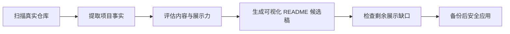

<a name="readmemagic"></a>
<p align="center">
  
</p>

<p align="center">
  <h1 align="center">✨ ReadmeMagic</h1>
  <p align="center">
    <strong>把任何代码仓库变成好看、清晰、有展示力的 GitHub 项目主页</strong><br>
    <em>Turn any repository into a beautiful, high-impact GitHub project page</em>
  </p>
  <p align="center">
    <a href="#-功能特性">功能特性</a> •
    <a href="#%EF%B8%8F-项目展示">项目展示</a> •
    <a href="#-安装">安装</a> •
    <a href="#-使用方法">使用方法</a> •
    <a href="#-模板">模板</a> •
    <a href="#-语言支持">语言支持</a> •
    <a href="#-示例">示例</a>
  </p>
</p>

<p align="center">
  
  
  
  
  
</p>

<p align="center">
  <a href="README.md">English</a> | <strong>中文</strong>
</p>

---

## ✨ 功能特性

<table>
  <tr>
    <td width="50%">
      <h3>🔍 项目感知分析</h3>
      <ul>
        <li>识别 Python、Node.js、Rust 和 Go 项目元数据</li>
        <li>提取真实的安装与使用命令</li>
        <li>分别评估内容、展示、上手体验与可信度</li>
      </ul>
    </td>
    <td width="50%">
      <h3>🛡️ 安全优化</h3>
      <ul>
        <li>默认生成 <code>README.optimized.md</code> 候选文件</li>
        <li>保留原文中仍然有效的专业内容</li>
        <li><code>--apply</code> 自动创建 <code>README.md.bak</code></li>
      </ul>
    </td>
  </tr>
  <tr>
    <td width="50%">
      <h3>🤖 Agent 优先</h3>
      <ul>
        <li>符合 Codex 规范的 Skill 元数据</li>
        <li>基于仓库证据的 README 审查流程</li>
        <li>内置质量门槛与安全规则</li>
      </ul>
    </td>
    <td width="50%">
      <h3>🌐 模板与语言</h3>
      <ul>
        <li>支持中文和英文智能优化</li>
        <li>5 类模板均提供英文 / 中文 / 双语变体</li>
        <li>可选徽章、Star History 与 Banner 生成</li>
      </ul>
    </td>
  </tr>
</table>

> ReadmeMagic 将 README 视为项目的核心展示页：首屏讲清价值、真实视觉素材展示项目、核心亮点便于扫描，并提供最短的可验证上手路径。

---

## 🖼️ 项目展示



ReadmeMagic 将确定性的仓库事实与 Agent 的编辑能力分开：CLI 负责生成安全、有依据的候选稿，Agent 再强化项目叙事、视觉素材和差异化亮点。

---

## 📦 安装

> **前置条件**：Python 3.8+

```bash
# 从源码安装
git clone https://github.com/GetIT-Sunday/ReadmeMagic-github-readme-design-skill.git
cd ReadmeMagic-github-readme-design-skill
pip install -e .
```

<details>
<summary><strong>📋 备选：通过 pip 安装</strong></summary>
<br>

```bash
# 通过 pip 安装（发布后可用）
pip install ReadmeMagic
```

</details>

<div align="right"><a href="#readmemagic">↑ 返回顶部</a></div>

---

## 🚀 使用方法

**① 检查项目类型与仓库证据**

```bash
readme-magic inspect --project-path ./my-project
readme-magic inspect --project-path ./my-project --json
```

检查报告会输出项目类型、识别置信度，以及带来源的安装命令、使用命令、文档、策略文件和截图、Benchmark 等展示证据。

**② 诊断现有 README**

```bash
readme-magic analyze --project-path ./my-project
readme-magic analyze --project-path ./my-project --json
```

**③ 生成安全的优化候选文件**

```bash
# 写入 my-project/README.optimized.md，不修改原 README.md
readme-magic optimize --project-path ./my-project

# 审核候选文件后应用，并自动备份 README.md.bak
readme-magic optimize --project-path ./my-project --apply
```

**④ 从模板生成新 README**

```bash
# 英文 README（默认）
readme-magic generate --project-path ./my-project

# 中文 README
readme-magic generate --project-path ./my-project --lang zh

# 中英双语 README
readme-magic generate --project-path ./my-project --lang bilingual
```

**⑤ 选择模板**

```bash
readme-magic generate --template ai-project --lang zh
readme-magic generate --template cli-tool --lang bilingual
readme-magic generate --template standard --lang en
```

**⑥ 自定义颜色、徽章与 Banner**

```bash
# 使用已有 Banner 图片
readme-magic generate \
  --template standard \
  --lang bilingual \
  --primary-color "#667eea" \
  --secondary-color "#764ba2" \
  --badges version,license,python,stars \
  --star-history --repo "owner/repo" \
  --banner assets/banner.png

# 通过 GPT Image 自动生成 Banner（dodo AI 沙箱环境）
readme-magic generate \
  --template standard \
  --lang zh \
  --repo "owner/repo" \
  --gen-banner
```

<details>
<summary><strong>⑥ 查看可用模板（可选）— 点击展开</strong></summary>
<br>

```bash
readme-magic templates
```

</details>

<div align="right"><a href="#readmemagic">↑ 返回顶部</a></div>

---

## 📖 文档

- [`SKILL.md`](SKILL.md) — Agent 工作流、证据规则与安全应用策略
- [`references/readme-rubric.md`](references/readme-rubric.md) — README 100 分质量评估标准
- [`README.md`](README.md) — 完整英文文档

<div align="right"><a href="#readmemagic">↑ 返回顶部</a></div>

---

## 🌐 语言支持

ReadmeMagic 支持三种语言模式，通过 `--lang` 参数选择：

| 模式 | 参数 | 说明 |
|------|------|------|
| 英文 | `--lang en` | 所有章节标题和模板内容均为英文（默认） |
| 中文 | `--lang zh` | 所有章节标题和模板内容均为中文 |
| 双语 | `--lang bilingual` | 每个章节英文标题下附中文副标题 |

5 种模板均提供 EN / ZH / Bilingual 三个专属版本，目录结构如下：

```
readme_magic/templates/
├── en/          # 英文模板（同时作为默认模板）
│   ├── standard.md
│   ├── ai-project.md
│   ├── cli-tool.md
│   ├── library.md
│   └── personal.md
├── zh/          # 中文模板
│   ├── standard.md
│   ├── ai-project.md
│   ├── cli-tool.md
│   ├── library.md
│   └── personal.md
└── bilingual/   # 双语模板
    ├── standard.md
    ├── ai-project.md
    ├── cli-tool.md
    ├── library.md
    └── personal.md
```

<div align="right"><a href="#readmemagic">↑ 返回顶部</a></div>

---

## 📝 模板

<table>
<tr><th>模板名称</th><th>适用场景</th></tr>
<tr><td><code>standard</code></td><td>通用开源项目</td></tr>
<tr><td><code>ai-project</code></td><td>AI / ML / 深度学习项目</td></tr>
<tr><td><code>cli-tool</code></td><td>命令行工具</td></tr>
<tr><td><code>library</code></td><td>可复用库与框架</td></tr>
<tr><td><code>personal</code></td><td>个人作品集项目</td></tr>
</table>

<div align="right"><a href="#readmemagic">↑ 返回顶部</a></div>

---

## 🎨 颜色主题

<table>
<tr><th>主题</th><th>主色</th><th>辅色</th><th>适用场景</th></tr>
<tr><td>默认</td><td><code>#667eea</code></td><td><code>#764ba2</code></td><td>通用项目</td></tr>
<tr><td>深色</td><td><code>#1a1a2e</code></td><td><code>#16213e</code></td><td>技术类项目</td></tr>
<tr><td>海洋</td><td><code>#00b4db</code></td><td><code>#0083b0</code></td><td>现代风格项目</td></tr>
<tr><td>自然</td><td><code>#11998e</code></td><td><code>#38ef7d</code></td><td>开源工具</td></tr>
<tr><td>鲜明</td><td><code>#fc5c7d</code></td><td><code>#6a82fb</code></td><td>创意类项目</td></tr>
</table>

<div align="right"><a href="#readmemagic">↑ 返回顶部</a></div>

---

## 📁 项目结构

```
ReadmeMagic/
├── readme_magic/
│   ├── __init__.py
│   ├── analyzer.py         # 项目元数据扫描
│   ├── optimizer.py        # 安全候选文件生成
│   ├── quality.py          # README 100 分质量检查
│   ├── cli.py              # CLI 入口
│   └── templates/          # 打包后的英文 / 中文 / 双语模板
├── examples/
│   ├── ai-project.md
│   ├── cli-tool.md
│   └── python-library.md
├── pyproject.toml
├── SKILL.md
└── README.md
```

<div align="right"><a href="#readmemagic">↑ 返回顶部</a></div>

---

## 🧪 开发

<details>
<summary><strong>开发环境搭建、测试与格式化 — 点击展开</strong></summary>
<br>

```bash
# 安装开发依赖
pip install -e ".[dev]"

# 运行测试
pytest

# 代码格式化
black readme_magic/
```

</details>

<div align="right"><a href="#readmemagic">↑ 返回顶部</a></div>

---

## 🤝 贡献指南

欢迎所有形式的贡献，每一份参与都让 ReadmeMagic 变得更好！

1. Fork 本仓库
2. 创建功能分支（`git checkout -b feature/amazing-feature`）
3. 提交更改（`git commit -m 'feat: add amazing feature'`）
4. 推送分支（`git push origin feature/amazing-feature`）
5. 发起 Pull Request

详情请参阅 [CONTRIBUTING.md](CONTRIBUTING.md)。别忘了给项目点个 ⭐！

<div align="right"><a href="#readmemagic">↑ 返回顶部</a></div>

---

## 📄 许可证

本项目基于 **MIT 许可证** 分发。详情见 [LICENSE](LICENSE)。

<div align="right"><a href="#readmemagic">↑ 返回顶部</a></div>

---

## 🙏 致谢

- [shields.io](https://shields.io/) — 徽章生成
- [star-history.com](https://star-history.com/) — Star 增长图表
- [contrib.rocks](https://contrib.rocks/) — 贡献者头像墙

<div align="right"><a href="#readmemagic">↑ 返回顶部</a></div>

---

<p align="center">
  <sub>如果 ReadmeMagic 帮到了你，请给一个 ⭐ — 让更多人发现它！</sub>
</p>

<p align="center">
  <a href="https://star-history.com/#GetIT-Sunday/ReadmeMagic-github-readme-design-skill&Date">
    
  </a>
</p>
